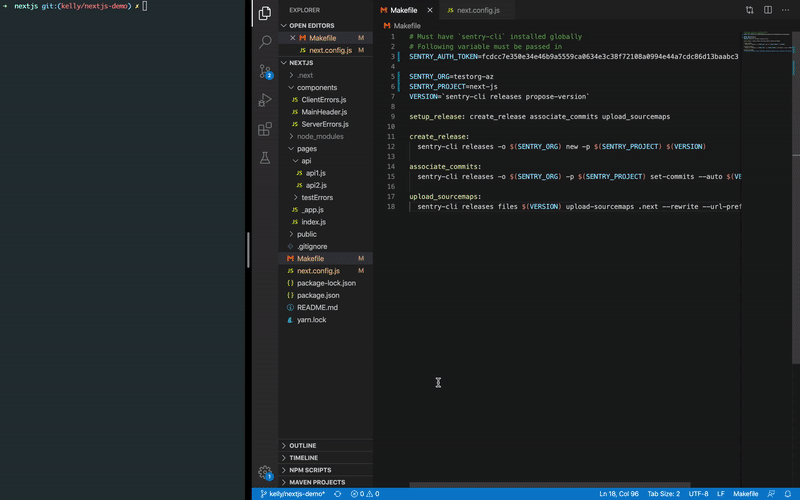
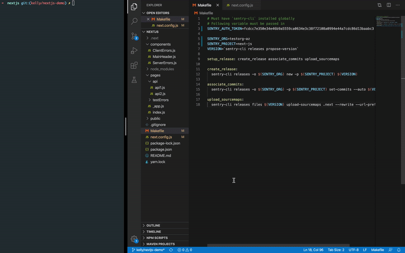

# NextJS Demo

This app demonstrates how to configure Sentry (both `@sentry/browser` and `@sentry/node`) in a NextJS application to capture:

- Unhandled exceptions
- Handled exception
- Capture message

You'll also be able to do the following:

- Capture the user
- Associate commits (make sure that your GitHub repo is integrated into your Sentry organization)
- Manaully upload source maps using `sentry-cli`
- Automatically upload source maps using the `sentry-webpack-plugin`. (Use with `npm run start`/production. This is an alternative to manually uploading source maps)

Official documentation:
- [Sentry JavaScript](https://docs.sentry.io/platforms/javascript/)
- [Sentry Node](https://docs.sentry.io/platforms/node/)

## Setup

#### Versions

    | dependency      | version           
    | ------------- |:-------------:| 
    | @sentry/browser | ^5.15.4 |
    | @sentry/node | ^5.15.4 |
    | sentry-cli | 1.53.0 |
    | @sentry/webpack-plugin | ^1.10.0 |
    | @zeit/next-source-maps | 0.0.4-canary.1 |
    | next | 9.3.6
    | react | 16.13.1 |
    | react-dom | 16.13.1 |
    | swr | ^0.2.0 |
    | node.js | 13.8.0 |

#### Instructions

1. `git clone git@github.com:sentry-demos/next-js.git`

2. Install dependencies
```
$ npm install
```

3. Create a Sentry project and replace `SENTRY_DSN` with your Sentry DSN in `next.config.js`

4. Include your `SENTRY_AUTH_TOKEN`, `SENTRY_ORG`, and `SENTRY_PROJECT` to the `Makefile`. If you haven't created an Auth Token, you can create one from your Sentry organization on the [API Keys](https://sentry.io/settings/account/api/auth-tokens/) page. Make sure that your GitHub repo is integrated with your Sentry Organization.

## Run Dev

1. Run the dev server and generate souce maps for the dev environment (this will create a `.next` folder)
```
$ npm run dev
```

2. Create a release, associate commits, and upload source maps
```
$ make setup_release
```

## Run Production

1. Build the production app and generate souce maps (this will create a `.next` folder)
```
$ npm run build
```

2. Create a release, associate commits, and upload source maps
```
$ make setup_release
```

3. If you only need to upload source maps

```
make upload_sourcemaps
```

4. If using `sentry-webpack-plugin`, uncomment the configuration in `next.config.js`

5. Run the production app
```
$ npm run start
```

## Updating

1. To upgrade NextJS

```
$ npm i next@latest react@latest react-dom@latest
```

## Additional Documentation

- [Sentry JavaScript](https://docs.sentry.io/platforms/javascript/)
- [Sentry Node](https://docs.sentry.io/platforms/node/)
- [NextJS](https://nextjs.org/)
- This is a [Next.js](https://nextjs.org/) project bootstrapped with [`create-next-app`](https://github.com/zeit/next.js/tree/canary/packages/create-next-app)

## GIF

#### Client



#### Server

